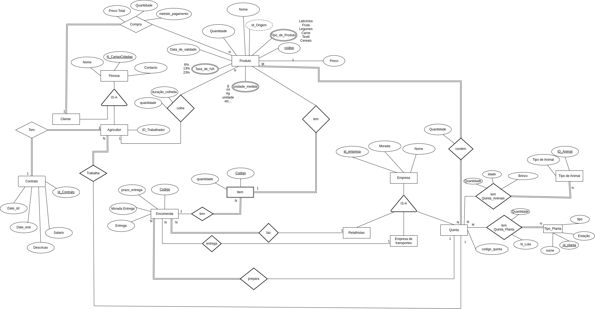
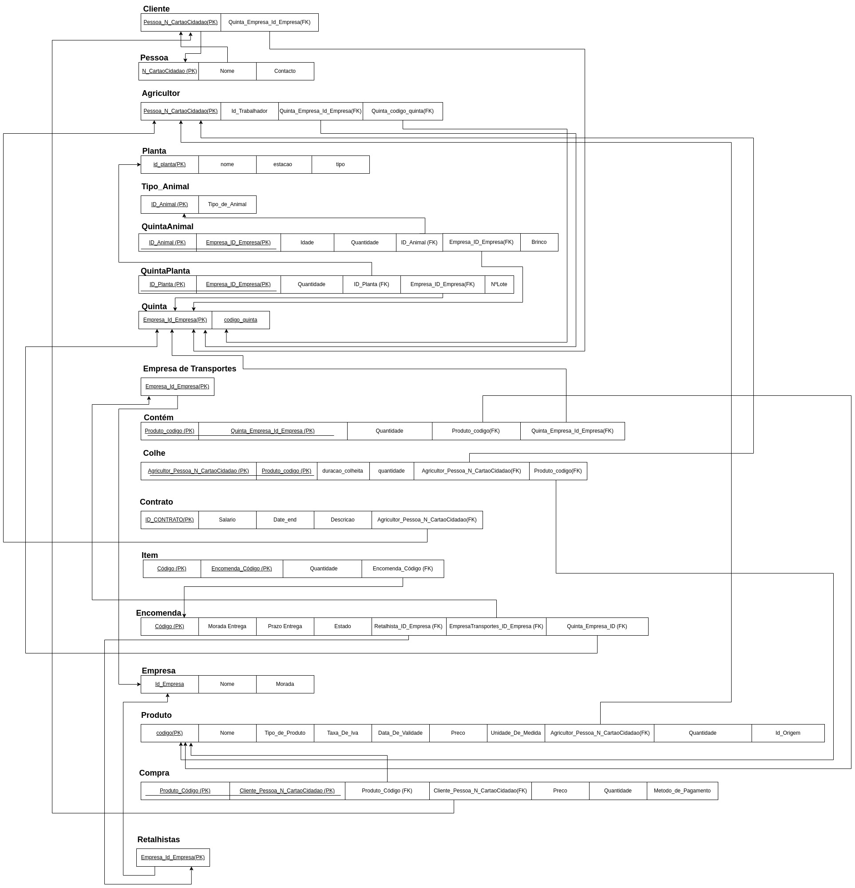

# BD: Trabalho Prático APFE

**Grupo**: PXGY
- Afonso Ferreira, MEC: 113480
- Tomás Brás, MEC: 112665

## Introdução / Introduction
 
Escreva uma pequena introdução sobre o trabalho.
Write a simple introduction about your project.

Motivação 
Decidimos escolher este tema porque reconhecemos a importância de uma abordagem mais tecnológica na gestão de dados relacionada com a produção agrícola. Uma base de dados de diversas quintas não só oferece uma visão abrangente e detalhada das operações agrícolas e por quem são aplicadas, mas também das entidades que as realizam. Este projeto não é apenas uma oportunidade para explorar o potencial da tecnologia na agricultura, mas também permite fazer uma melhor gestão e mostrar que uma quinta é um setor fundamental para o bem-estar humano e ambiental. Esta base de dados deverá trazer ao cliente uma forma fácil  de ver o que as diversas quintas têm para oferecer devendo ter métodos para dar uma resposta rápida e eficiente às necessidades do cliente e das entidades empresariais.

Funcionalidades
Durante a análise desta base de dados chegámos à conclusão que iríamos ter duas entidades com diferentes funcionalidades ao trabalhar com a base de dados. O utilizador pode simplesmente ver o que a quinta tem, neste caso, animais, plantas e produtos e também fazer compras presencialmente ou encomendas (neste caso como retalhista). O administrador por outro lado tem um número muito maior de funcionalidades, controlando todas as entidades da base de dados, podendo adicionar novas quintas e os respectivos produtos, animais, plantas que as mesmas apresentam. Para além disso deve também conseguir gerir o estado das encomendas.

## ​Análise de Requisitos / Requirements

## DER

## ER

